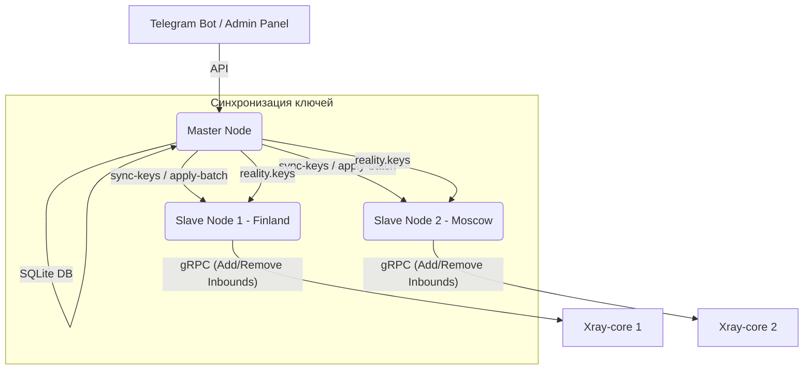

# ⚡ xraytool-go

**xraytool-go** — это высокопроизводительная система управления распределенным кластером VPN-узлов на базе **Xray-core** (VLESS, Hysteria2, VMess, Shadowsocks, Trojan) с архитектурой **Master-Slave** и поддержкой динамической ротации ключей Reality.

Проект разработан для автоматического поддержания актуального состояния пользователей, синхронизации конфигураций между серверами, автоматического распределения нагрузок и предоставления гибкого API подписок.

---

## ✨ Основные возможности

* 👥 **Синхронизация Master-Slave:** Централизованное управление пользователями в единой БД SQLite на Master-сервере с параллельной отправкой дельт изменений на подчиненные Slave-ноды.
* 🔑 **Динамическая ротация Reality:** Автоматическая генерация ключей X25519 и пула Short ID на Master с безопасной репликацией на Slaves по внутренней сети.
* ⚡ **Высокая производительность (Bulk Operations):** Переход от поштучного добавления пользователей к пакетной записи (`AddUsersBulk` / `RemoveUsersBulk`), что сокращает дисковые операции записи (I/O) и блокировку конфигурационных файлов Xray в **100+ раз**.
* 🛡️ **Защита от сбоев (Circuit Breaker):** Встроенный предохранитель gRPC-клиента с 10-секундным периодом остывания при недоступности Xray-core предотвращает зависание фоновой синхронизации и сетевые таймауты.
* 🎯 **Детерминированные Short ID:** Распределение пользователей по пулу Short ID на основе хэша их уникального ID подписки, что защищает от постоянной смены ключей на стороне клиента при регулярном обновлении подписок.
* 🔌 **Поддержка современных транспортов:** Полная совместимость с транспортом `xhttp` (SplitHTTP / XHTTP) для обхода жестких блокировок и мимикрии под стандартный HTTP/2 трафик.

---

## 🏗️ Архитектура системы



---

## 🛠️ Команды CLI

Утилита управления `xraytool` предоставляет следующие административные команды:

| Команда | Описание |
| :--- | :--- |
| `xraytool syncstates` | Запуск ручной или автоматической синхронизации состояния пользователей и Reality-ключей с Master на все Slaves. |
| `xraytool rotate-keys` | Принудительная генерация новых Reality-ключей X25519/Short ID на Master и их немедленная репликация по кластеру. |
| `xraytool rebuild-config` | Локальный пересбор конфигурационного файла `config.json` на текущем сервере из шаблона и базы данных. |
| `xraytool rebuild-config --sync` | Пересбор конфига локально с последующей рассылкой обновлений на все Slave-серверы. |

---

## ⚙️ Конфигурация (`config.yaml`)

Основные настройки для управления ротацией Reality и синхронизацией:

```yaml
# Режим работы сервера: "master" или "slave"
mode: master

# Настройки Reality-ключей и пула Short ID
reality:
  # Автоматически генерировать и ротировать ключи (только для Master)
  rotation_enabled: true
  # Путь хранения JSON-файла с ключами Reality
  keys_filepath: "/etc/xraytool/configs/reality.keys"

# Настройки API связи Master-Slave
slave_api:
  connect_timeout: 3s
  request_timeout: 30s
  remote_path: "/api/v1/internal/xray/sync"
```

---

## 🚀 Быстрый старт

### 1. Сборка проекта
Для сборки бинарного файла выполните команду:
```bash
go build -o bin/xraytool main.go
```

### 2. Запуск тестов
Для верификации работы всех модулей (включая интеграционные тесты gRPC-клиента и синхронизации):
```bash
go test ./...
```

### 3. Принудительная ротация Reality-ключей
Сгенерировать новые ключи и разослать их на все подчиненные серверы:
```bash
xraytool rotate-keys
```

---

## 🔒 Безопасность

* Все API-запросы между Master и Slave защищены заголовком авторизации `X-API-Key`.
* Конфигурационные файлы Xray (`config*.json`) автоматически исключены из Git-отслеживания во избежание утечки приватных ключей и персональных UUID пользователей.
