# ⚡ xraytool-go

**xraytool-go** — это специализированное корпоративное решение для централизованного управления распределенной сетью VPN-узлов на базе **Xray-core**. Система автоматизирует синхронизацию пользователей, динамически ротирует ключи безопасности Reality, управляет лимитами устройств и предоставляет отказоустойчивое API подписок для интеграции с биллингами и Telegram-ботами.

---

## 📖 1. Описание проекта и решаемые проблемы

При масштабировании VPN-сервисов до десятков серверов и тысяч пользователей стандартные средства управления Xray-core сталкиваются с инфраструктурными проблемами. Этот инструмент решает ключевые из них:

1. **Проблема жестких дисков и локов файлов (I/O Bottleneck):**  
   При поштучном добавлении 100+ клиентов во время синхронизации база данных и конфигурационный файл на диске перезаписывались 100+ раз подряд. На слабых серверах это приводило к дисковому таймауту и падению синхронизации с ошибкой `timeout awaiting response headers`.  
   *Решение:* Полный переход на групповые bulk-операции (`AddUsersBulk` / `RemoveUsersBulk`). Конфиг перезаписывается ровно один раз, снижая дисковую нагрузку в **100+ раз**.
   
2. **Dial Storm и сетевые задержки при сбоях:**  
   Если один из подчиненных серверов (Slave) отключался, Master-узел пытался достучаться до него через gRPC, инициируя каскадные сетевые таймауты по 3 секунды на каждый запрос. Это блокировало очередь синхронизации всего кластера.  
   *Решение:* Реализован **Circuit Breaker** (предохранитель) с 10-секундным кэшированием сетевых ошибок. Если узел недоступен, gRPC-клиент мгновенно возвращает кэшированную ошибку без нагрузки на сеть.

3. **Смена Short ID при обновлении подписок:**  
   При каждом запросе подписки клиент получал случайный Short ID из пула Reality. Это приводило к сбросу активных соединений на стороне клиента при регулярном обновлении профиля.  
   *Решение:* Внедрена **SHA256-детерминированная привязка**. Конкретному пользователю выдается стабильный Short ID, вычисленный на основе хэша ID его подписки.

---

## 🏗️ 2. Архитектура и схемы работы

### Схема синхронизации данных (Sequence Diagram)

Ниже представлена детальная схема взаимодействия компонентов при добавлении пользователя и последующей синхронизации серверов:

```mermaid
sequenceDiagram
    autonumber
    actor Admin as Telegram Bot / API
    participant Master as Master Server (xraytool)
    participant DB as SQLite Database
    participant Slave as Slave Uzel (xraytool)
    participant Xray as Xray-Core Service

    Admin->>Master: Добавить подписку (POST /api/v1/user)
    Master->>DB: Запись пользователя и UUID
    DB-->>Master: Подтверждение записи
    Master-->>Admin: Успешный ответ (UUID сгенерирован)

    Note over Master, Slave: Периодический цикл синхронизации (или команда --sync)
    
    Master->>DB: Сбор слепка активных пользователей
    DB-->>Master: Список активных подписок
    Master->>Master: Чтение reality.keys (генерация при отсутствии)
    Master->>Slave: Отправка ключей (POST /sync-keys)
    Slave->>Slave: Сохранение reality.keys на диск
    Master->>Slave: Отправка слепка пользователей (POST /apply-batch)
    
    rect rgb(30, 30, 40)
        Note over Slave, Xray: Процесс применения на Slave
        Slave->>Slave: Генерация config.json (Шаблон + Ключи + Пользователи)
        Slave->>Xray: Дифференциальное обновление клиентов через gRPC (Bulk API)
        alt gRPC недоступен
            Slave->>Slave: Перезапуск службы Xray через systemd
        end
    end
    
    Slave-->>Master: Результат синхронизации (Успешно)
```



---

## ⚙️ 3. Функциональные подсистемы

### 3.1 Ротация Reality-ключей и Short ID
В системе реализовано разделение ответственности между Master и Slave узлами:
* **Master (`rotation_enabled: true`):** При старте проверяет наличие файла `reality.keys`. При отсутствии генерирует новую пару ключей X25519 и массив из 15 Short ID. Команда `rotate-keys` удаляет старый файл и инициирует генерацию новой пары.
* **Slave (`rotation_enabled: false`):** Никогда не генерирует ключи локально во избежание расхождений. Ожидает передачи слепка от Master. При отсутствии файла на старте выводит `WARN` в лог, но не падает, продолжая работу на заглушках до первой синхронизации.

Для подстановки ключей в подписки используются плейсхолдеры `{PBK}` (публичный ключ) и `{SID}` (Short ID), которые автоматически заменяются на стороне API подписок:
```
vless://{UUID}@{HOST}:443?security=reality&pbk={PBK}&sid={SID}&sni={SNI}#NodeName
```

### 3.2 Предохранитель gRPC-соединения (Circuit Breaker)
Для предотвращения каскадных зависаний HTTP-запросов gRPC-клиент оборачивает вызовы набора номера (`dial`) в защитный кэширующий слой:
```go
// Если gRPC-сервер Xray-core недоступен:
// 1. Первая попытка подключения завершается ошибкой.
// 2. Ошибка кэшируется в памяти на 10 секунд.
// 3. Все последующие вызовы в течение 10 секунд мгновенно возвращают ошибку без сетевого ожидания.
```

### 3.3 Поддержка XHTTP и SplitHTTP
Система имеет полную структурную поддержку транспорта `xhttp` (SplitHTTP). Билдер конфигурации сканирует массив `inbounds` и определяет протокол на основе JSON-объекта, обеспечивая автоматический инжект приватных ключей и детерминированных Short ID во все подходящие Reality инбаунды независимо от используемого сетевого транспорта (`tcp`, `xhttp`, `splithttp`, `mkcp`).

---

## 🛠️ 4. Административный CLI Справочник

Все операции выполняются через основной бинарный файл `xraytool`. Для запуска команд внутри Docker-контейнера используйте `docker exec -it xraytool_backend ./xraytool <команда>`.

### Сводная таблица команд

| Команда | Флаги / Опции | Описание | Пример использования |
| :--- | :--- | :--- | :--- |
| **`syncstates`** | *Нет* | Синхронизирует состояние пользователей и ключей с Master на Slaves. | `xraytool syncstates` |
| **`rotate-keys`** | *Нет* | Принудительно ротирует Reality ключи и Short ID на Master и рассылает их на Slaves. | `xraytool rotate-keys` |
| **`rebuild-config`** | `--sync` | Пересобирает файл `config.json` из шаблона и базы данных. Флаг `--sync` запускает последующий `syncstates` на Slaves. | `xraytool rebuild-config --sync` |
| **`sync-xray`** | *Нет* | Восстанавливает расхождения UUID между базой данных SQLite и запущенным Xray-core. | `xraytool sync-xray` |

---

## 📄 5. Полная файловая структура проекта

Архитектура xraytool-go строго разделена на слои. Ниже описано назначение каждого модуля в папке `internal`:

```
xraytool-go/
├── cmd/                          # CLI Контроллеры (Cobra)
│   ├── apply_batch.go           # Применение изменений от Master к Slave
│   ├── genbalancer.go           # Утилита генерации конфигураций балансировщика
│   ├── rebuild_config.go        # Пересбор локального config.json
│   ├── rotate_keys.go           # Ротация ключей Reality
│   ├── server.go                # Запуск HTTP сервера API
│   ├── sync_xray.go             # Сверка UUID базы данных и Xray-core
│   └── root.go                  # Точка входа в CLI
├── internal/                     # Бизнес-логика приложения
│   ├── antifraud/               # Контроль мультидевайса, баны за превышение лимитов IP
│   ├── appconfig/               # Чтение и валидация config.yaml
│   ├── convert/                 # Конвертеры типов данных и форматов строк
│   ├── database/                # Репозитории доступа к данным (GORM + SQLite)
│   ├── domain/                  # Доменные структуры, интерфейсы репозиториев
│   ├── events/                  # Система событий, роутинг вебхуков оповещений
│   ├── generate/                # Хелперы генерации UUID, паролей, случайных строк
│   ├── legacy/                  # Совместимость со старым форматом JSON-файлов базы
│   ├── logger/                  # Настройка структурированного логирования (slog)
│   ├── mailer/                  # Сервис отправки SMTP-оповещений пользователям
│   ├── mocks/                   # Моки репозиториев и сервисов для юнит-тестирования
│   ├── payment/                 # Интеграция с платежными шлюзами (Stars, YooMoney)
│   ├── safeio/                  # Потокобезопасная и атомарная запись файлов на диск
│   ├── server/                  # HTTP-роутер, middleware авторизации, обработчики API
│   ├── slave/                   # Сборка Master-слепков и HTTP-клиент связи со Slaves
│   ├── statesync/               # Сервис сверки разницы и синхронизации серверов
│   ├── stats/                   # Сбор и агрегация статистики трафика из Xray-core
│   ├── subscription/            # Сервис рендеринга и кэширования клиентских подписок
│   ├── user/                    # Сервис бизнес-логики управления пользователями
│   ├── vpn/                     # Адаптер управления Xray-core (gRPC, Билдер, Ротатор)
│   └── worker/                  # Фоновые воркеры (проверка таймаутов, антифрод, чистка)
├── tests/                       # Интеграционные и системные тесты
├── Dockerfile                   # Контейнеризация приложения
└── docker-compose.yml           # Сценарий Docker Compose (App + Xray + Volume)
```

---

## 💾 6. Схема Базы Данных (GORM Models)

Система использует базу данных SQLite. Основные таблицы и связи описаны ниже:

```
 ┌────────────────┐         ┌──────────────────┐         ┌──────────────┐
 │     Users      │         │  Subscriptions   │         │   Devices    │
 ├────────────────┤         ├──────────────────┤         ├──────────────┤
 │ ID (PK)        │1       *│ ID (PK)          │1       *│ ID (PK)      │
 │ Username       ├────────>│ UserID (FK)      ├────────>│ SubID (FK)   │
 │ IsBlocked      │         │ Email            │         │ IP           │
 │ CreatedAt      │         │ XrayUUID         │         │ UserAgent    │
 └────────────────┘         │ Status           │         │ LastActiveAt │
                            │ MaxDevices       │         └──────────────┘
                            │ StartsAt/EndsAt  │
                            └──────────────────┘
```

---

## 🐳 7. Руководство по развертыванию (Docker Compose)

Рекомендуемый метод запуска системы — совместное развертывание бэкенда и Xray-core в Docker-окружении.

### Пример файла `docker-compose.yml`

```yaml
version: '3.8'

services:
  xraytool_backend:
    image: xraytool_backend:latest
    container_name: xraytool_backend
    restart: always
    volumes:
      - ./data:/etc/xraytool
      - ./xray_config:/usr/local/etc/xray
      - /var/run/docker.sock:/var/run/docker.sock
    ports:
      - "8080:8080"
    environment:
      - APP_ENV=production
    depends_on:
      - xray_core

  xray_core:
    image: teddysun/xray:latest
    container_name: xray_core
    restart: always
    volumes:
      - ./xray_config:/usr/local/etc/xray
      - ./logs:/var/log/xray
    ports:
      - "443:443"
      - "10085:10085" # gRPC API Порт
```

---

## 🔍 8. Диагностика и Устранение неполадок (FAQ)

### В логах бэкенда ошибка `context deadline exceeded` при синхронизации
* **Причина:** Ведомый сервер (Slave) не отвечает в рамках таймаута, либо Xray-core на стороне Slave завис при обработке gRPC-команд.
* **Решение:** Проверьте доступность API Slave-сервера с помощью `curl` и состояние службы Xray на удаленной стороне (`systemctl status xray`). Запустите `xraytool rebuild-config --sync` для принудительного обновления.

### Reality-ключи не подставляются на Slave-сервере
* **Причина:** Slave-сервер запущен с флагом ротации ключей, либо не выполнена первичная синхронизация с Master.
* **Решение:** Убедитесь, что в файле `config.yaml` на Slave-сервере установлено `rotation_enabled: false`. Выполните `xraytool syncstates` на Master-сервере для принудительной передачи ключей.

### Ошибка `unknown config id: api` при запуске Xray-core
* **Причина:** В конфигурационном файле `config.json` в секции `outbounds` вручную добавлен блок с протоколом `api`.
* **Решение:** Xray-core автоматически создает внутренний outbound с тегом `api` при наличии секции `"api": { ... }` в корне конфигурации. Удалите вручную добавленный outbound `api` из шаблона `XrayConfig.template.json` и пересоберите конфиг командой `xraytool rebuild-config`.
