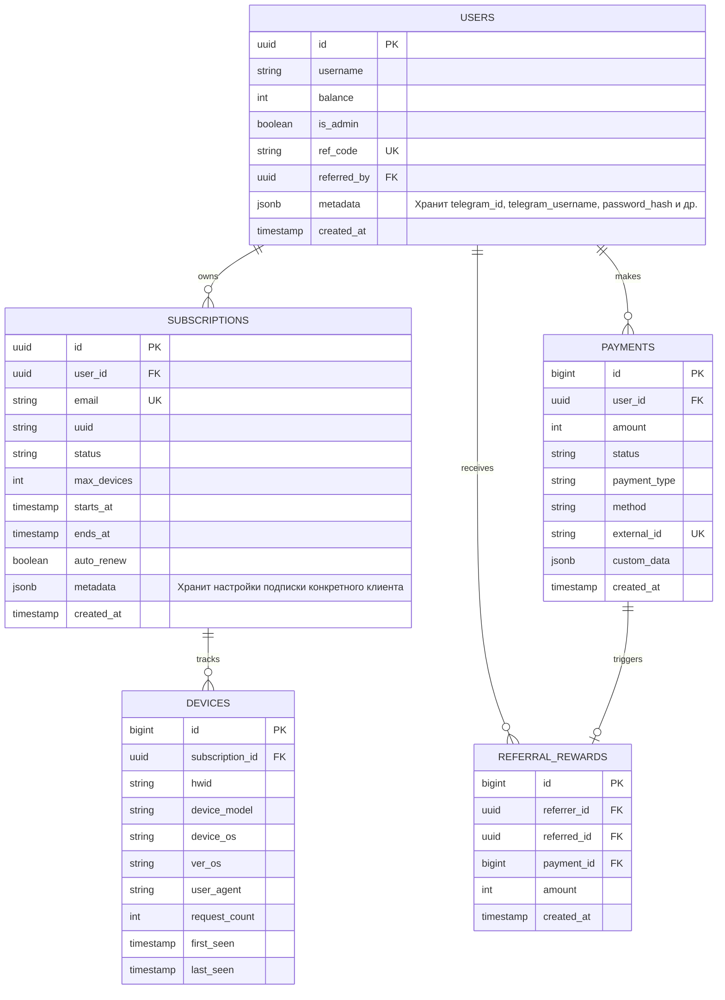

# Согласованная архитектура и план перехода на централизованный Go-бэкенд XrayTool

Этот документ фиксирует утвержденные архитектурные решения по созданию независимого, централизованного бэкенд-сервиса вокруг `xraytool`. Бот и веб-сайт выступают исключительно в роли «тонких клиентов», взаимодействующих с системой только через REST API.

---

## 1. Утвержденный стек и принципы независимости

1. **Принцип автономности**: `xraytool` является единственным владельцем бизнес-логики, базы данных и взаимодействия с Xray-Core. Бот и веб-сайт не имеют прямого доступа к файлам конфигурации Xray или СУБД, обращаясь только к REST API `xraytool`.
2. **База данных**: **PostgreSQL** (драйвер `pgx` + ORM `GORM` в Go). Она заменяет локальные файлы [bot.db](file:///C:/Dev/SERVER/Clients/bot.db), [limited_users.db](file:///C:/Dev/SERVER/xraytool-go/config.example.yaml#L20) и [devices_state.json](file:///C:/Dev/SERVER/Clients/config.py#L20).
3. **Декаплинг схемы через JSONB**: Чтобы сохранить `xraytool` полностью независимым от платформ (Telegram-бота, веб-сайта, будущих приложений), в схеме базы данных **нет** специфических колонок вроде `telegram_id` или `telegram_username`. Все профильные данные клиентских платформ хранятся в универсальном индексируемом поле `metadata` типа `JSONB`.
4. **Объединение проектов**: Код из [REST-API](file:///C:/Dev/SERVER/REST-API) переносится внутрь [xraytool-go](file:///C:/Dev/SERVER/xraytool-go). REST-сервер запускается напрямую из бинарного файла `xraytool` (например, командой `xraytool start-server`).
5. **Служба подписок**: PHP-скрипт [sub.php](file:///C:/Dev/SERVER/sub.php) полностью выводится из эксплуатации. Запросы подписок перенаправляются на HTTP-эндпоинт Go-сервера (роут `/api/v1/sub`).
6. **Универсальные вебхуки и события**: Бэкенд реализует **Event-Driven архитектуру** (систему подписки на события). Любое изменение статуса генерирует стандартное событие, которое рассылается по списку зарегистрированных вебхуков. Это позволяет легко подключить будущий сайт или стороннюю аналитику.
7. **Развертывание**: Бэкенд, Xray-Core и Веб-сайт размещаются на одном VPS-сервере. Nginx выступает в роли reverse-proxy, перенаправляя внешние запросы к API и сайту.
8. **Логирование**: Внедрение структурированного логирования (`slog` из стандартной библиотеки Go). Уровень логирования настраивается через конфигурационный файл (`debug`, `info`, `warn`, `error`). Логи выводятся в stdout и опционально дублируются в файл с поддержкой JSON- и консольного форматов.

---

## 2. Схема базы данных (PostgreSQL)



### Формат поля `metadata` в таблице `users`
Данные клиентов (Telegram-бот, веб-панель) хранятся в поле `metadata`. 
*   **Для Telegram-пользователя**:
    ```json
    {
      "telegram_id": 1203034433,
      "telegram_username": "radetski",
      "source": "telegram_bot"
    }
    ```
    *Индексирование*: Для быстрого поиска пользователя по Telegram ID в Go-сервисе создается функциональный индекс:
    `CREATE INDEX idx_users_telegram_id ON users ((metadata->>'telegram_id'));`
*   **Для Веб-пользователя**:
    ```json
    {
      "email": "user@example.com",
      "password_hash": "$2a$12$...",
      "email_verified": true,
      "source": "website"
    }
    ```

---

## 3. Универсальная система событий (Event Engine)

При возникновении важного изменения в системе генерируется JSON-событие стандартного формата:

```json
{
  "event_id": "evt_01j7q3b2x4...",
  "event_type": "payment.completed",
  "timestamp": "2026-05-31T20:56:18Z",
  "data": {
    "user_id": "76df1733-4f81-4203...",
    "payment_id": 412,
    "amount": 159,
    "payment_type": "subscription_extension"
  },
  "user_metadata": {
    "telegram_id": 1203034433,
    "telegram_username": "radetski",
    "source": "telegram_bot"
  }
}
```

### Основные типы событий (Event Types):
*   `payment.completed` — Успешное подтверждение оплаты. Бот использует его для поздравления пользователя и обновления меню.
*   `payment.failed` — Ошибка транзакции или отмена.
*   `subscription.expired` — Истечение срока действия подписки. Бот может прислать напоминание со ссылкой на продление.
*   `device.limit_reached` — Попытка скачать конфигурацию подписки с нового устройства при исчерпанном лимите. Полезно для мгновенного уведомления в Telegram: *"Вы превысили лимит устройств. Сбросить лишние девайсы можно в меню..."*

---

## 4. Новая структура проекта Go (`xraytool-go`)

После интеграции REST-сервера структура каталогов будет выглядеть следующим образом:

```
xraytool-go/
├── cmd/
│   ├── root.go             # Базовый интерфейс Cobra CLI
│   ├── server.go           # Новая команда "xraytool start-server"
│   └── migrate_db.go       # Новая команда "xraytool db-migrate" (импорт из SQLite)
├── internal/
│   ├── database/           # Инициализация GORM + модели БД
│   │   ├── db.go
│   │   └── models.go
│   ├── server/             # REST API хендлеры и маршрутизация (net/http или Gin)
│   │   ├── router.go
│   │   ├── auth.go
│   │   ├── handlers_user.go
│   │   ├── handlers_sub.go
│   │   └── handlers_payment.go
│   ├── events/             # Универсальный диспетчер событий и отправка вебхуков
│   │   └── dispatcher.go
│   ├── xrayapi/            # Клиент gRPC API для горячего управления Xray
│   └── subscription/       # Генератор подписок (проверка HWID и лимитов девайсов)
├── main.go
└── config.yaml             # Конфигурация бэкенда (подключение к PG, порты, ключи, вебхуки)
```

---

## 5. Спецификация API (Go-бэкенд)

### Для пользователей и подписок (запросы от VPN-приложений):
*   `GET /api/v1/sub?id={client_uuid}` — Генерация и выдача конфигураций подписки (заменяет `sub.php`). Проверяет статус оплаты в БД, считывает и валидирует HWID устройства, обновляет таблицу `devices`.

### Для Telegram-бота и Веб-панели (запросы под API-ключом авторизации):
*   `GET /api/v1/users/telegram/{tg_id}` — Получить баланс, статус подписки, реф-код пользователя.
*   `POST /api/v1/users/register` — Регистрация нового пользователя (Telegram / Web).
*   `POST /api/v1/payments/create` — Создать платеж (Platega SBP / карта / наличные). Возвращает ссылку на оплату.
*   `GET /api/v1/subscriptions/{sub_email}/devices` — Список привязанных HWID-устройств.
*   `DELETE /api/v1/devices/{device_id}` — Удаление устройства (освобождение слота).
*   `POST /api/v1/admin/users/{email}/set-expire` — (Админ) Установить дату окончания подписки (синхронизируется в Xray по gRPC).
*   `POST /api/v1/admin/users/{email}/block` — (Админ) Заблокировать подписку.

### Входящие коллбэки:
*   `POST /api/v1/payments/platega/callback` — Обработка уведомления об успешном платеже от Platega. Go-сервис переводит статус в `completed`, обновляет подписку в БД, применяет реферальные бонусы, после чего генерирует событие `payment.completed` и рассылает вебхуки.

---

## 6. Дорожная карта миграции

### Этап 1: Подготовка БД и Схемы
1. Поднятие PostgreSQL.
2. Реализация GORM-моделей в `internal/database/models.go` и запуск автомиграции при старте сервиса.
3. Написание консольной команды `db-migrate` для переноса существующих данных из [bot.db](file:///C:/Dev/SERVER/Clients/bot.db) и Xray JSON-конфига в PostgreSQL.

### Этап 2: Перенос API-сервера в Go и Event Engine
1. Интеграция REST API роутера в `xraytool-go`.
2. Реализация роута выдачи подписки `/api/v1/sub` в памяти Go-сервиса с использованием данных из таблицы `devices` (вместо чтения JSON-файлов устройств).
3. Перенос обработчика платежей Platega в Go.
4. Разработка модуля `internal/events` для диспетчеризации событий и отправки вебхуков с повторными попытками при ошибках (Retry Policy).

### Этап 3: Рефакторинг Python-бота
1. Удаление [sqltools.py](file:///C:/Dev/SERVER/Clients/sqltools.py).
2. Создание REST API клиента в боте (асинхронные HTTP-вызовы в бэкенд на Go).
3. Настройка локального веб-сервера бота на порту `8081` для приема универсальных событий (`/api/v1/notify`) и отправки Telegram-уведомлений.

### Этап 4: Разработка Веб-сайта
1. Разработка фронтенд-панели (Next.js), которая подключается к тому же REST API `xraytool` для аутентификации пользователей и администрирования.
2. Подключение веб-панели к системе событий (например, через WebSockets или SSE) для реал-тайм обновлений интерфейса админа.

---

## 7. Логирование и уровни логов

Бэкенд использует структурированное логирование (`slog`) с поддержкой вывода в JSON-формате (для серверов сбора логов в продакшене) и консольного текстового формата (для разработки).

### Уровни логирования:
*   **DEBUG** — Подробная техническая информация (полные gRPC-запросы/ответы, отладочная информация парсинга заголовков подписок).
*   **INFO** — Ключевые события системы (запуск серверов, входящие API-запросы, успешные генерации подписок, проведение оплат).
*   **WARN** — Непредвиденные ситуации, не приводящие к сбою приложения (превышение лимита устройств пользователем, неизвестный User-Agent, ошибки валидации входных данных).
*   **ERROR** — Критические ошибки (отказ подключения к PostgreSQL или Xray gRPC, ошибки базы данных, недоступность диска для записи файлов состояния).

### Настройка логирования в `config.yaml`:
```yaml
logging:
  # Уровень логирования: "debug", "info", "warn", "error" (по умолчанию: "info")
  level: "info"
  # Путь к файлу логов (если пустой — вывод только в stdout)
  file_path: "/var/log/xraytool/xraytool.log"
  # Формат логов: "json" (для продакшена/сервера) или "console" (для разработки)
  format: "console"
```
